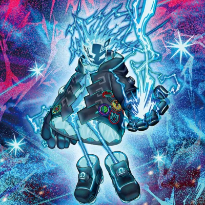

## FRIDAY ONLINE!

 
 
 

<!-- ===== CURRICULO ===== -->

<table>

<!-- ===== HEAD CV ===== -->
<thead>

<tr align="center">

<th colspan="2">

# **_👾 BAKU STARK CV 👾_**

</th>

</tr>

</thead>

<!-- ===== BODY CV [RIGHT] ===== -->
<tbody>

<td>
<!-- ==== TABLE CONTACTS ==== -->

<table>

<thead>

<tr align="right">

<th>

**📱 CONTACTS 📱**

</th>
</tr>

</thead>

<tbody>

<!-- TWITTER BADGE -->
<tr align="center">

<td>

</td>

</tr>

<!-- LINKEDIN BADGE -->
<tr align="center">

<td>

</td>

</tr>
<!-- INSTAGRAM BADGE -->
<tr align="center">

<td>

</td>

</tr>

<!-- REDDIT BADGE -->
<tr align="center">

<td>

</td>

</tr>

</tbody>

</table>

</td>

<td>

## **⌨️ ABOUT ME**
_Wallace (Baku-Stark), 22 years_

_Full Stack Developer_

_Programming since April 2022_

## **⌨️ SKILLS**
_Python_

_JavaScript_

_HTML n' CSS_

_Java_

_C++_

_Rust_

<table>

<tr align="center">

<td>
    
     
    <a
      href="https://discord.com/api/oauth2/authorize?client_id=1055540316725313626&permissions=8&scope=applications.commands%20bot"
    >Spright Blue [Discord Bot]
    </a>
</td>
</tr>

<tr align="center">

<td>

Language: `Python`
</td>

</tr>

</table>

</td>
<!-- ==== END OF TABLE CONTACTS ==== -->

<!-- ==== STATUS ==== -->
<tr align="center">

<td>

</td>

<td>

</td>

</tr>

<tr align="center">

<td colspan="2">

</td>

</tr>
<!-- ==== END OF STATUS ==== -->

<!-- ==== ACHIEVEMENTS ==== -->
<tr align="center">

<th colspan="2">

## 🏅 ACHIEVEMENTS 🏅

</th>

</tr>

<tr align="center">

<td colspan="2">

  

</td>

</tr>
<!-- ==== END OF ACHIEVEMENTS ==== -->

<!-- ==== TECHNOLOGIES ==== -->
<tr align="center">

<th colspan="2">

## 🖱️ TECHNOLOGIES 🖱️

</th>

</tr>

<tr align="center">

<td>

  <table>

  <thead>

  <tr align="center">

  <th colspan="1">OPERATIONAL SYSTEM</th>

  </tr>

  </thead>

  <tbody>

  <tr align="center">

  <td>

  

  </td>

  </tr>

  </tbody>

  </table>

</td>

<td>

<table>
  <thead>

  <tr align="center">

  <th colspan="2">DataBase</th>

  </tr>

  </thead>

  <tbody>

  <tr align="center">

  <td>

  

  </td>

  <td>

  

  </td>

  </tr>

  </tbody>
</table>

</td>

</tr>

<!-- -(BROWSERS)- -->
<tr align="center">

<td colspan="2">

<table>

  <thead>
  
  <tr align="center">

  <th colspan="3">BROWSERS</th>

  </tr>

  </thead>
  <tbody>

  <tr align="center">
  <td>
    
  </td>

  <td>
    
  </td>

  <td>
    
  </td>
  </tr>

  </tbody>

</table>

</td>

</tr>
<!-- -(BROWSERS)- -->

<!-- -(FRONT-END)- -->
<tr align="center">

<td colspan="2">

<table>

  <thead>
  
  <tr align="center">

  <th colspan="4">FRONT-END</th>

  </tr>

  </thead>
  <tbody>

  <tr align="center">
  <td> 
    
  </td>

  <td> 
     
  </td>

  <td> 
    
  </td>

  <td>
    
  </td>
  </tr>
  
  </tbody>

</table>

</td>

</tr>
<!-- -(END OF FRONT-END)- -->

<!-- -(FRAMEWORS)- -->
<tr align="center">

<td colspan="2">

<table>
  <thead>
  <tr align="center">

  <th colspan="5">FRAMEWORKS</th>

  </tr>
  </thead>
  <tbody>
  <tr align="center">
  
  <td>
    
  </td>

  <td>
    
  </td>

  <td>
    
  </td>

  <td>
    
  </td>

  <td>
    
  </td>

  </tr>
  </tbody>
</table>

</td>

</tr>
<!-- -(FRAMEWORS)- -->

<!-- -(LANGUAGES)- -->
<tr align="center">

<td colspan="2">

<table>
  <thead>

  <tr align="center">

  <th colspan="6">LANGUAGES</th>

  </tr>

  </thead>
  <tbody>

  <tr align="center">

  <td> 
       
  </td>

  <td>
    
  </td>

  <td>
     
  </td>

  <td> 
     
  </td>

  <td>
     
  </td>

  <td> 
     
  </td>

  </tr>

  </tbody>
</table>

</td>

</tr>
<!-- -(END OF LANGUAGES)- -->

<!-- -(SOFTWARES)- -->
<tr align="center">

<td colspan="2">

  <table>

  <thead>

  <tr align="center">

  <th colspan="7">SOFTWARES</th>

  </tr>

  </thead>

  <tbody>

  <tr align="center">
      <td>
        
      </td>
      <td>
        
      </td>
      <td>
        
      </td>
      <td>
        
      </td>
      <td>
        
      </td>
      <td>
        
      </td>
      <td>
        
      </td>
  </tr>

  </tbody>

  </table>

</td>

</tr>
<!-- -(END OF SOFTWARES)- -->

<!-- ==== END OF TECHNOLOGIES ==== -->

</tbody>

</table>

<!-- ===== END OF CURRICULO ===== -->
