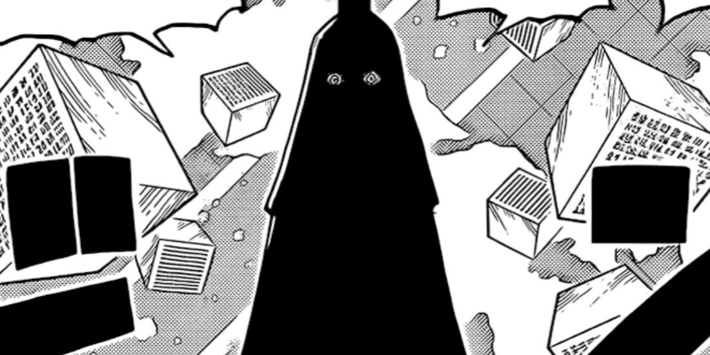

## FRIDAY ONLINE!

## **_👾 BAKU STARK CV 👾_**

⬇️ Update: `Baku Stark CV`

> **⌨️ | ABOUT ME**

 ` 🇧🇷 ` | Meu começo na programação veio pelo Curso Em Vídeo (Python - 3 módulos completos). Desde então, continuo aprimorando constantemente as minhas habilidades no desenolvimento Front e Back End, visando ser um excelente profissional na área Full Stack.

 ` 🇺🇸 ` | My start in programming came through the Video Course (Python - 3 complete modules). Since then, I have continued to constantly improve my skills in Front and Back End development, aiming to be an excellent professional in the Full Stack area.

 

- _Wallace (Baku-Stark) de Freitas, 23 years_

- _Full Stack Developer_

- _Software Engineer (Jala University)_

- _Programming since April 2022_

> **📱 | CONTACTS**

> **⌨️ | BOOTCAMPS**

<table>

  <thead>

  <tr align="center">

  <th colspan="2">DIO BOOTCAMPS</th>

  </tr>

  </thead>

  <tbody>

  <tr align="center">
  <td>
  <table>

  <tr align="center">

  <td>
      
       
      <a
        href="https://web.dio.me/track/7da9882f-2f0d-4f4d-b997-f300ce50f9f5"
      >Santander 2024 - Backend com Java
      </a>
  </td>
  </tr>

  <tr align="center">

  <td>

  Language: 
   
  </td>
  </tr>
  </table>
  
  </td>
  <td>

  <table>

  <tr align="center">

  <td>
      
       
      <a
        href="https://web.dio.me/track/70304c16-a7d8-4066-97de-16345e1653a6"
      >Python AI Backend Developer
      </a>
  </td>
  </tr>

  <tr align="center">

  <td>

  Language: 
    
  </td>

  </tr>

  </table>

  </td>

  </tr>
  </tbody>
</table>

 

> **⌨️ | SKILLS**

 

 

 

 

----

## **_👾BAKU STARK - Projects👾_**

<table>

  <thead>

  <tr align="center">

  <th colspan="2">DISCORD BOTS</th>

  </tr>

  </thead>

  <tbody>

  <tr align="center">
  <td>
  <table>

  <tr align="center">

  <td>
      
       
      <a
        href="https://discord.com/api/oauth2/authorize?client_id=1055540316725313626&permissions=8&scope=applications.commands%20bot"
      >Imu Bot [Discord Bot]
      </a>
  </td>
  </tr>

  <tr align="center">

  <td>

  Language: 
   
  </td>
  </tr>
  </table>
  
  </td>
  <td>

  <table>

  <tr align="center">

  <td>
      
       
      <a
        href="https://discord.com/api/oauth2/authorize?client_id=1055540316725313626&permissions=8&scope=applications.commands%20bot"
      >Spright Blue [Discord Bot]
      </a>
  </td>
  </tr>

  <tr align="center">

  <td>

  Language: 
    
  </td>

  </tr>

  </table>

  </td>

  </tr>
  </tbody>
</table>

